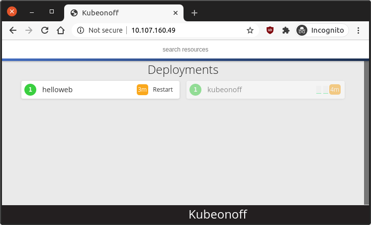

# A simple web UI for managing Kubernetes deployments

## Intro

Kubeonoff is a small web UI that allows to quickly stop/start/restart pods.
It will also have visual cues that draws your attention is any pod or
deployment is behaving suspicously, such as:

  1. pods with restarting containers
  1. pods with cpu or memory near the configured limit
  1. deployments that don't have all the required replicas up and ready

A secondary goal of kubeonoff is to have a UI that non-developers can use, for
when the application is on fire and restarting it might fix it temporarily,
before calling a developer.

## Quickstart

Kubeonoff is a small web app that needs to be deployed to a specific k8s
namespace.  It is totally namespace specific.  To manage muliple namespaces in
the same cluster, kubeonoff needs to be deployed for each namespace.

The file `deploy/kubeonoff.yaml` contains a sample deployment manifest,
including a kubeonoff Service, a Deployment, as well a service account and
RBAC permissions:

    kubectl -n you-namespace apply -f deploy/kubeonoff.yaml

Now you can find out the service IP:

    $ kubectl get svc kubeonoff
    NAME         TYPE        CLUSTER-IP      EXTERNAL-IP   PORT(S)   AGE
    kubeonoff    ClusterIP   10.107.160.49   <none>        80/TCP    78m

Which means you should be able to open `http://10.107.160.49` in a browser.

